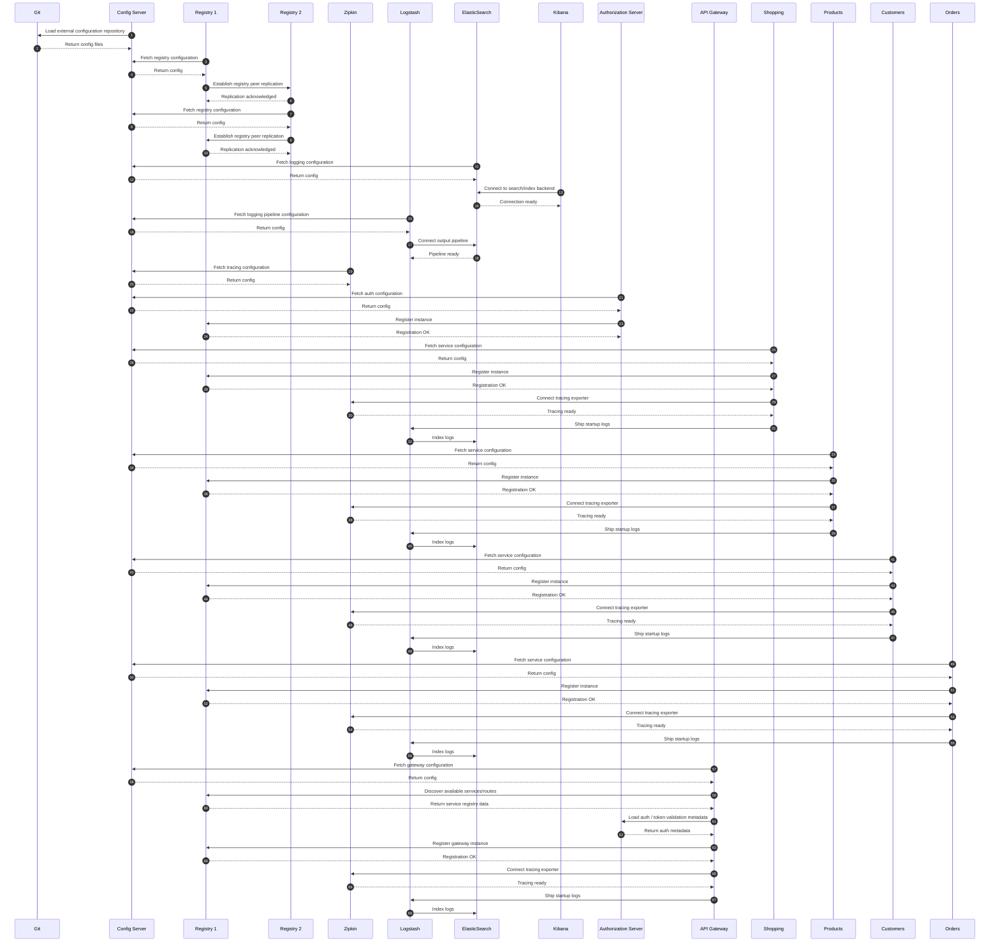
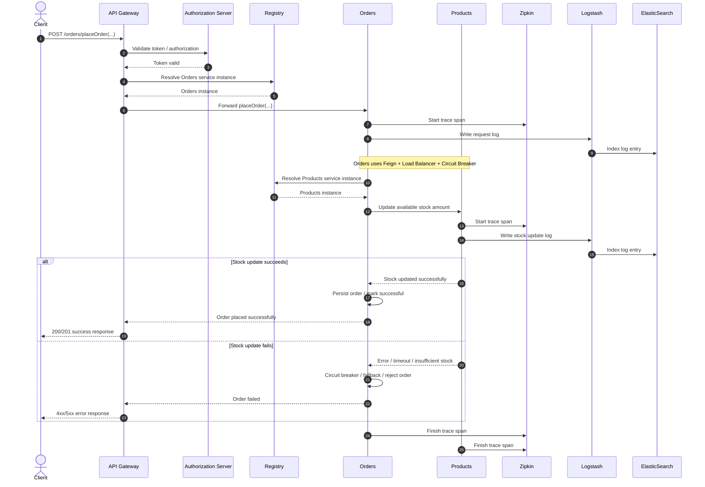

# Sequence Diagrams
Assumptions used in the diagrams:

- `Config Server` reads external configuration from `Git`
- services register themselves in `Registry`
- `API Gateway` routes client traffic to backend services through service discovery
- tracing data is sent to `Zipkin`
- logs are shipped to `Logstash`, then indexed in `ElasticSearch`, and viewed in `Kibana`
- `Authorization Server` is available before client-facing traffic starts
- `Orders` calls `Products` through Feign + Load Balancer + Circuit Breaker

## Startup Sequence

This diagram shows the recommended startup order and the main calls each service performs while starting.

## placeOrder Scenario

This diagram shows the call flow when the client places an order and `Orders` updates stock in `Products`.

